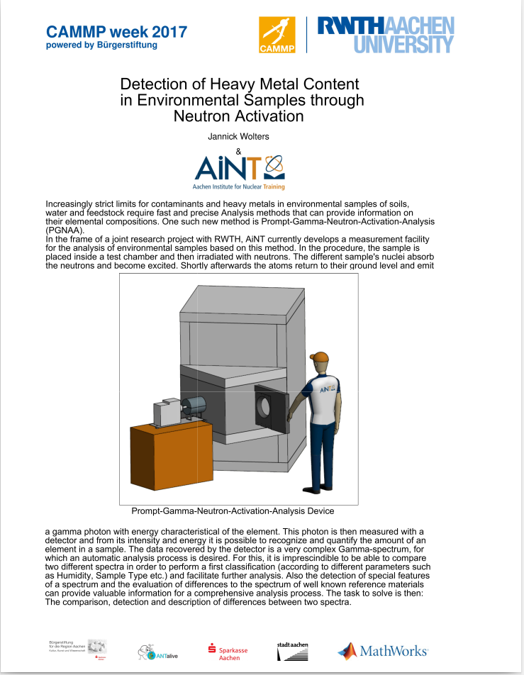
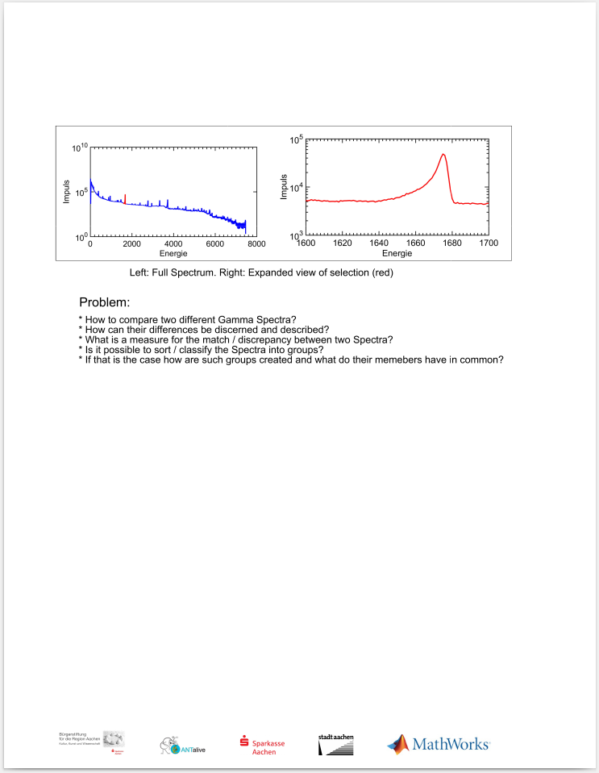

# Heavy_Metal_Content_analysis
Proyecto Final del Bootcamp de Ciencias Computacional Aplicada: “Physics REBoot Venezuela”. 

"Detection of Heavy Metal Content in Environmental Samples using PGGNA"

